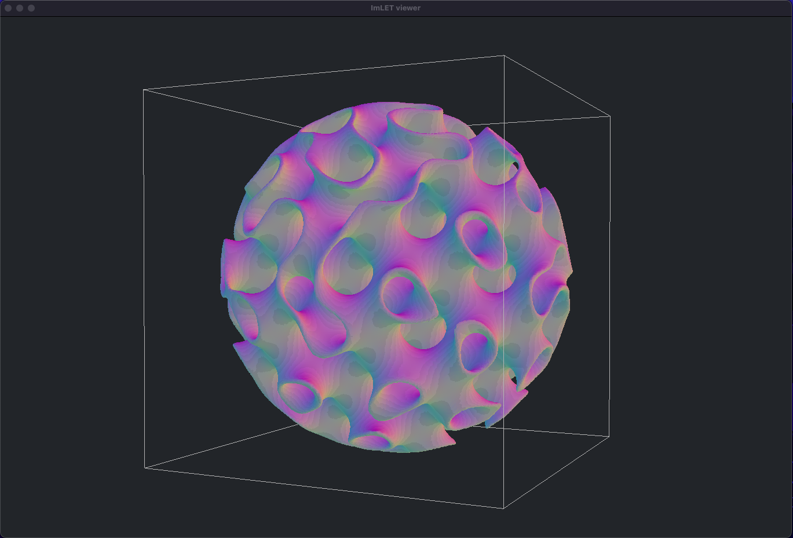

### Implicit Modeling Lightweight Exploration Toolkit (Imlet)




## Overview

**Imlet** is a Rust library for implicit geometry generation using the marching cubes algorithm. It provides a flexible and efficient toolkit for creating complex 3D models defined by mathematical functions. The library is based on the logic by [Paul Bourke](https://paulbourke.net/geometry/polygonise/), making it a powerful choice for procedural modeling, CAD, and computational design.

## Features

- **Implicit Functions**: Define geometries using distance functions, from equations or triangle meshes.
- **Modular Design**: Easily combine and manipulate implicit functions by building computations graphs with operations.
- **Marching Cubes Algorithm**: Convert implicit functions into polygonal meshes.

## Example Usage

Here’s a simple example demonstrating how to use ImLET to create a model combining a sphere and a gyroid:

```rust
use imlet::{BoundingBox, Vec3, ImplicitModel, Sphere, Gyroid, Thickness, Intersection, Viewer};

fn main() {
    let size: f32 = 10.0;
    let cell_size = 0.05;
    let model_space = BoundingBox::new(Vec3::origin(), Vec3::new(size, size, size));

    // Build model
    let mut model = ImplicitModel::new();

    model.add_function(
        "Sphere",
        Sphere::new(Vec3::new(0.5 * size, 0.5 * size, 0.5 * size), 0.45 * size),
    );

    model.add_function(
        "Gyroid", 
        Gyroid::with_equal_spacing(2.5, true)
    );
    
    model.add_operation_with_inputs(
        "ThickGyroid", 
        Thickness::new(1.5), &vec!["Gyroid"]
    );
    
    model.add_operation_with_inputs(
        "Output",
        Intersection::new(),
        &vec!["Sphere", "ThickGyroid"]
    );

    Viewer::run(model, model_space, cell_size, "Output");
}
```

## Roadmap

### Base Features
- [x] Update README with detailed examples and usage instructions.
- [ ] Improve SDF (Signed Distance Function) computation, addressing issues with leaking and pseudonormals.
- [ ] Integrate [Rhai](https://rhai.rs/), a scripting language for Rust, for enhanced customization.
- [ ] Implement serialization for models, potentially using sealed traits.
- [ ] Enhance the viewer with interactive buttons and runtime script loading.

### Future Enhancements
- [ ] Enable GPU-based computation for faster processing.
- [ ] Develop a node editor for visual programming.

## License

This project is licensed under either of the following:

- [MIT License](LICENSE-MIT) 
- [Apache License, Version 2.0](LICENSE-APACHE)

Choose the one that best suits your needs.